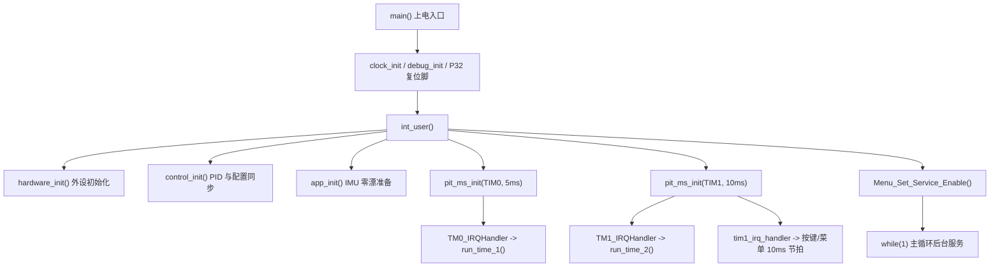

# 整体运行流程

这份文档面向第一次接触本项目代码的人，目标是先建立“车从上电到跑起来”的整体链路。细节参数和单个模块实现可以继续看各模块文档，这里只抓主流程、周期任务和数据流。

## 先从哪里看

建议按下面顺序阅读源码：

1. `project/user/main.c`：系统入口、主循环和调试服务开关。
2. `project/user/int_user.c`：硬件、控制器和应用层初始化。
3. `project/user/isr.c`：定时器中断如何挂到周期任务。
4. `project/user/a_run.c`：5ms 主控制链和 10ms 状态链。
5. `project/user/ADC.c`、`project/service/pid.c`、`project/service/motor.c`：采样、控制计算和电机输出。
6. `project/user/a_run_track_element.c`、`project/user/a_run_fly.c`：圆环、圆桶、跷跷板和墙面等特殊元素流程。

可以把整个项目先理解成三条线：

- 初始化线：上电后配置硬件、加载参数、初始化 PID 和 IMU。
- 实时线：定时器中断固定周期执行采样、控制和保护。
- 调试线：主循环处理菜单、VOFA 和打印等低优先级服务。



## 上电初始化流程

`main()` 是程序入口，当前启动顺序如下：

1. `clock_init(SYSTEM_CLOCK_40M)` 设置系统时钟。
2. `debug_init()` 初始化库函数调试接口。
3. `P32 = 1` 配置硬件强制复位/下载保护相关引脚。
4. `int_user()` 执行用户层总初始化。
5. `Menu_Set_Service_Enable((uint8)MAIN_ENABLE_MENU)` 按编译开关决定是否启用菜单服务。
6. 进入 `while (1)`，只做低优先级后台服务。

`int_user()` 内部再分三段：

- `hardware_init()`：初始化延时、IPS 屏幕、IMU、EEPROM、编码器、ADC、电机 PWM、负压 PWM、无线串口，并把 `tim1_irq_handler` 挂到 `timer1_service_10ms()`。
- `control_init()`：初始化左右速度环、转向外环和角速度内环，然后调用 `control_apply_config()`，把 EEPROM 恢复到 `app` 的配置同步到 `PID` 运行实例。
- `app_init()`：调用 `imu_calibrate_gyro_z_zero_drift()`，上电静止时准备 gyro_z 零漂补偿。

最后 `int_user()` 调用：

- `pit_ms_init(TIM0_PIT, TIME_0)`，当前 `TIME_0 = 5`，用于主控制环。
- `pit_ms_init(TIM1_PIT, TIME_1)`，当前 `TIME_1 = 10`，用于状态管理、按键和菜单节拍。

## 5ms 高频控制链

`TM0_IRQHandler()` 是核心控制环入口。当前 `MAIN_ENABLE_ISR_RUN_TIME_1 = 1`，所以每 5ms 会调用 `run_time_1()`。

主链路可以按下面理解：

```text
TM0_IRQHandler
  -> run_time_1
       -> a_run_apply_iap_guard
       -> read_AD
       -> Encoder_get
       -> a_run_mode_get_start_state
       -> imu_update_gyro_z_from_imu660rc
       -> a_run_track_element_update_gate
       -> pid_steer_update
       -> a_run_fly_update_speed
       -> a_run_track_element_update_angle_target
       -> pid_angle_update
       -> pid_speed_update(left/right)
       -> motor_output
```

各步骤职责：

- `a_run_apply_iap_guard()`：检测 P32，必要时跳转到 ISP/IAP 下载相关流程，要求极低耗时。
- `read_AD()`：读取四路电感，做排序去极值、归一化和 `Err` 偏差计算。
- `Encoder_get()`：读取并清零左右编码器计数，更新 `PID.left_speed.speed` 和 `PID.right_speed.speed`。
- `imu_update_gyro_z_from_imu660rc()`：刷新当前 5ms 控制周期使用的 `gyro_z`。
- `a_run_track_element_update_gate()`：推进特殊元素仲裁，决定当前开放左圆环、右圆环、圆桶、跷跷板还是墙面流程，并为圆环流程累计里程和 gyro_z 转角。
- `pid_steer_update()`：根据电感偏差 `Err` 生成目标角速度。当前通过 `steer_div_10` 分频，不是每个 5ms 周期都更新一次转向外环。
- `a_run_fly_update_speed()`：在跷跷板/飞坡流程中覆盖目标速度，并在高风险阶段限制转向。
- `a_run_track_element_update_angle_target()`：圆环阶段用固定目标角速度覆盖普通循迹目标。
- `pid_angle_update()`：用 gyro_z 反馈跟踪目标角速度，输出左右轮差速量。
- `pid_speed_update()`：左右轮速度闭环，把目标速度和编码器反馈转为 PWM 输出量。
- `motor_output()`：只有 `start_state == 2` 才输出电机 PWM，否则输出 0；内部还会处理停车保护、起步 PWM 爬坡和方向控制。

这条链路运行在中断中，不能加入 `printf`、延时、复杂文本解析或长时间阻塞逻辑。调试显示、菜单和串口解析应该留在主循环或低频路径。

## 10ms 状态管理链

`TM1_IRQHandler()` 是状态管理入口。当前 `MAIN_ENABLE_ISR_RUN_TIME_2 = 1`，所以每 10ms 会先调用 `run_time_2()`，随后执行 `tim1_irq_handler`。在 `hardware_init()` 中，`tim1_irq_handler` 被设置为 `timer1_service_10ms()`。

当前 10ms 链路：

```text
TM1_IRQHandler
  -> run_time_2
       -> scan_track_max_value
       -> a_run_mode_update_start_state
       -> lost_lines
       -> dianya_jiance
       -> motor_stall_check_10ms
       -> fuya_set_percent
       -> soft_timer_update_10ms
  -> timer1_service_10ms
       -> Keystroke_Scan_10ms
       -> Menu_Tick_10ms
```

主要职责：

- `scan_track_max_value()`：动态记录电感最大/最小值，供标定和调试观察。
- `a_run_mode_update_start_state()`：读取 P36 启动按键，维护 `0-停止 / 1-预启动 / 2-运行` 状态机。
- `lost_lines()`：四路电感持续过低时触发 `stop = 1`，飞坡高风险窗口可临时屏蔽。
- `dianya_jiance()`：采样电池电压，持续欠压后触发停车保护。
- `motor_stall_check_10ms()`：检测高 PWM 低速度的堵转风险。
- `fuya_set_percent(app.start.fuya_xili)`：当前代码在 `start_state == 1` 时设置负压百分比；`a_run_mode_update_fuya_state()` 保留但未接入当前 `run_time_2()` 主链。
- `soft_timer_update_10ms()`：更新软件定时器。
- `Keystroke_Scan_10ms()` 和 `Menu_Tick_10ms()`：仅在菜单服务启用时运行，为主循环菜单渲染和交互提供节拍。

10ms 链路实时性压力低于 5ms 主控链，但仍在中断上下文中，应避免长延时和大量串口输出。

## 主循环后台服务

`main()` 的 `while (1)` 不承担循迹控制，只处理无法放进严格时间轴的低优先级任务。当前开关定义在 `project/user/isr.h`：

| 开关 | 当前值 | 作用 |
| --- | --- | --- |
| `MAIN_ENABLE_VOFA` | `0` | 是否在主循环执行 `debug_vofa_service()` |
| `MAIN_ENABLE_MENU` | `1` | 是否在主循环执行 `Keystroke_Menu()` |
| `MAIN_ENABLE_SPEED_TEST` | `0` | 是否启用速度/IMU 等测试打印 |
| `MAIN_ENABLE_ISR_RUN_TIME_1` | `1` | 是否在 TM0 中断执行 5ms 主控链 |
| `MAIN_ENABLE_ISR_RUN_TIME_2` | `1` | 是否在 TM1 中断执行 10ms 状态链 |

菜单当前还有一层运行态保护：当 `a_run_mode_get_start_state() == 2` 时，主循环不刷新屏幕菜单，避免 UI 占用竞速控制资源。

VOFA、菜单和打印都适合作为调试入口，不应该成为比赛态高频控制的必要依赖。

## 特殊元素流程

特殊元素仲裁在 `a_run_track_element_update_gate()` 中执行，并跟随 5ms 主控制链更新。当前顺序是串行开放：

```text
左圆环 / 右圆环
  -> 圆桶
  -> 跷跷板/飞坡（当元素序列中配置 5）
  -> 墙面
  -> 回到圆环序列首项
```

这样做的目的不是同时识别所有元素，而是用 `expected_element` 限定当前允许进入的元素，减少圆桶、墙面过渡段误触发下一次圆环。

几个关键点：

- 左圆环入口由四路电感特征和连续确认次数触发。
- 圆环过程中会用 `ring_data.diff_set` 覆盖目标角速度，完成进环、环内和出环。
- 左/右环完成事件只消费一次，随后进入圆桶流程。
- 圆桶流程通过电感强信号窗口、回地确认和稳定延时推进。
- 跷跷板/飞坡是否进入由元素序列决定；需要跳过时从序列中删掉 5。
- 跷跷板/飞坡流程由 `a_run_fly_update_speed()` 处理弱磁检测、离线保持、落地恢复和完成事件。
- 墙面流程完成计时后，才重新开放下一次左圆环。

## 参数流转

当前运行参数以 `app` 为配置真值，以 `PID` 为控制器运行副本，以 EEPROM/IAP 区域为掉电保存位置。

```text
EEPROM
  -> eeprom_init
  -> app
  -> control_apply_config
  -> PID

menu / vofa
  -> 修改 app
  -> control_apply_config
  -> PID 立即生效

config_save
  -> control_apply_config
  -> eeprom_flash
  -> EEPROM
```

理解这条链后，调参时就能区分三件事：

- 改 `app`：只是改内存中的配置真值。
- 调 `control_apply_config()`：把配置同步到当前运行控制器，立即影响控制行为。
- 调 `config_save()` / `eeprom_flash()`：把参数持久化，掉电后仍保留。

## 第一次排查时抓哪几个变量

快速理解运行状态时，优先看这些全局量：

| 变量 | 来源 | 作用 |
| --- | --- | --- |
| `app` | `eeprom.c` | 全局配置真值 |
| `PID` | `pid.c` | 速度环、转向外环、角速度内环运行状态 |
| `ad1~ad4` / `Err` | `ADC.c` | 四路电感归一化值和循迹偏差 |
| `gyro_z` | `imu.c` | 当前控制周期角速度反馈 |
| `left_target` / `right_target` | `a_run.c` | 左右轮目标速度 |
| `flat_fly` | `a_run.c` / `a_run_fly.c` | 飞坡/跷跷板阶段 |
| `stop` | `motor.c` | 停车保护锁存 |
| `dianya` | `motor.c` | 电池电压估算值 |

第一次读代码时，不建议先钻进所有库文件。先把 `main -> int_user -> isr -> a_run` 这条主干走通，再看 `ADC/PID/Motor` 三个控制核心，最后再看特殊元素状态机和调参入口，会更容易建立完整地图。
